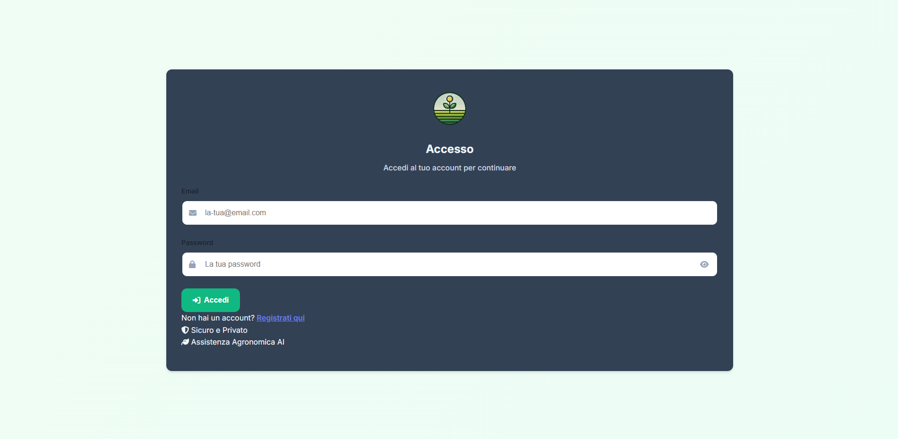
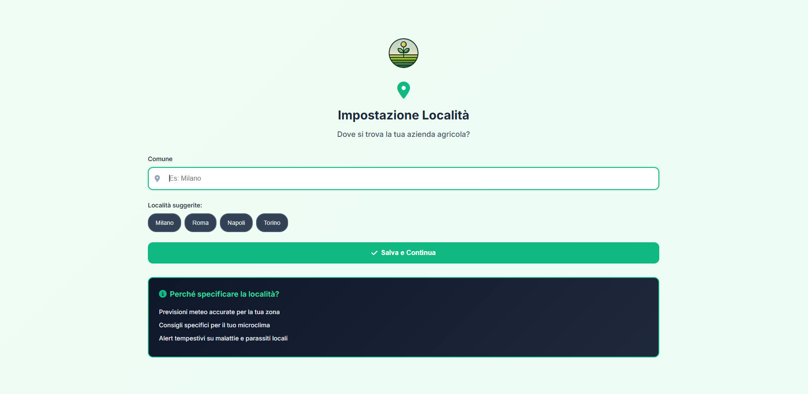
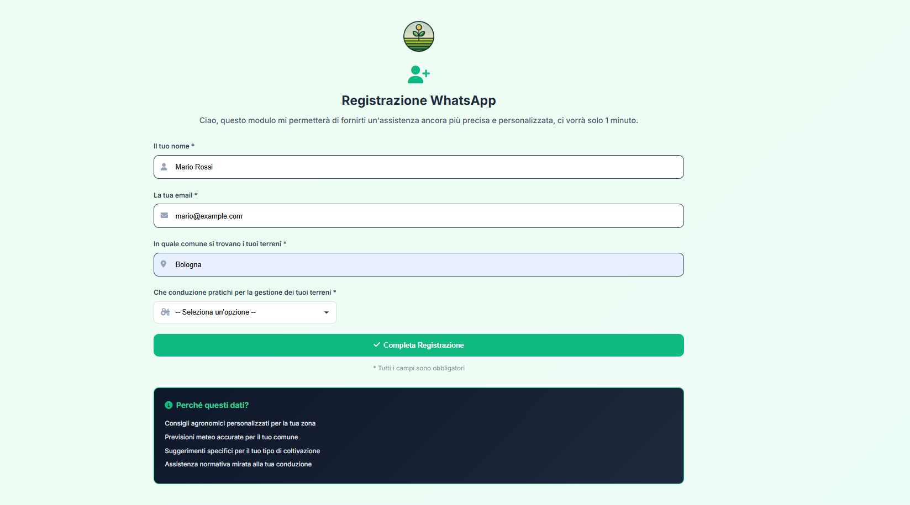

# 🌿 Italian Agronomist AI Chatbot — WhatsApp & Web

> A production-grade AI agricultural assistant built for Italian small-scale farmers.
> Delivered via **WhatsApp** and a **web chat interface**, powered by RAG (Retrieval-Augmented Generation) and OpenAI GPT-4o.
>
> ✅ **Production-tested** — deployed and actively used by **30+ real farmers for 3 months**, passing all real-world usage scenarios comfortably.

---

> [!IMPORTANT]
> **This is a presentation repository — no source code is published here.**
>
> This repo exists to showcase the system's capabilities, architecture, and technical depth.
> The complete codebase, system prompts, AI knowledge base, and infrastructure configuration are proprietary.
>
> **If you need information about the codebase, want access to the full source code, or are interested in collaboration, licensing, or IP transfer — contact me directly:**
>
> 📧 **[giduthuri.jsd2@gmail.com](mailto:giduthuri.jsd2@gmail.com)**
> 💼 **[linkedin.com/in/deepak-giduthuri-a88883188](https://www.linkedin.com/in/deepak-giduthuri-a88883188/)**
> 📅 **[Book a call — calendly.com/js-deepakgiduthuri](https://calendly.com/js-deepakgiduthuri)**

---

## 🎯 What It Does

Farmers message the AI assistant in Italian and receive expert agronomic advice — personalized to their location, crop type, and farming method. The system handles:

- **Disease diagnosis** — identifying fungal infections, pest damage, nutrient deficiencies from text or photos
- **Treatment planning** — recommending active substances, dosage, application timing
- **Regulatory guidance** — SIAN database references, CAA procedures, organic compliance
- **Image analysis** — farmers send photos of diseased plants and receive a visual diagnosis
- **Field record capture** — structured logging of treatment records (DDT, trattamenti)

The AI persona is a warm, knowledgeable Italian agronomist — not a generic chatbot. It responds exclusively in **Italian**, uses natural phrasing, and adapts advice to the user's specific commune, current season, and crop variety.

---

## 📸 Screenshots

### Web Login


### Web Onboarding


### WhatsApp Onboarding


### WhatsApp Conversation Flow
*Screenshot coming soon*

---

## ✨ Key Features

| Feature | Detail |
|---|---|
| **Dual-channel delivery** | Web UI + WhatsApp via Twilio |
| **RAG knowledge base** | ChromaDB vector search over Italian agricultural documents — 12 domains, YAML-structured |
| **Knowledge base builder** | Standalone engine to build or update the ChromaDB from curated YAML documents |
| **GPT-4o vision** | Farmers send plant photos for AI-powered disease diagnosis |
| **Personalized responses** | Adapts by location (comune), crop, farming type, and season |
| **WhatsApp onboarding** | Secure one-time token link — web-based user registration from WhatsApp |
| **GDPR compliance** | Full consent tracking (terms, privacy, marketing) with immutable audit log |
| **Conversation persistence** | Full history across sessions, across both channels |
| **Async message processing** | Background-thread processing avoids Twilio's 15-second webhook timeout |
| **Observability** | LangFuse integration for conversation analytics and token usage tracking |
| **Server-side sessions** | DB-backed sessions — no sensitive data in browser cookies |

---

## 🏗️ Architecture

**4 independent microservices** deployed on Google Cloud Run — each scales independently and to zero when idle.

```
User (Web Browser)             User (WhatsApp)
        │                             │
        ▼                             ▼
┌───────────────────┐     ┌───────────────────────┐
│   Main Web App    │     │   WhatsApp Service     │
│                   │     │                        │
│  Flask UI         │     │  Twilio webhook        │
│  Email auth       │     │  Signature verify      │
│  Session mgmt     │     │  Async processing      │
│  Orchestration    │     │  Image handling        │
└────────┬──────────┘     └──────────┬─────────────┘
         │                           │
         └─────────────┬─────────────┘
                       │  Internal HTTP
            ┌──────────┴──────────┐
            │                     │
            ▼                     ▼
   ┌─────────────────┐   ┌──────────────────────┐
   │   RAG Service   │   │      DB Service       │
   │                 │   │                       │
   │  ChromaDB       │   │  PostgreSQL 15        │
   │  Vector search  │   │  SQLAlchemy ORM       │
   │  GPT-4o         │   │  REST API             │
   │  LangFuse       │   │  9 tables             │
   └────────┬────────┘   └──────────┬────────────┘
            │                       │
            ▼                       ▼
      Google Cloud Storage     Google Cloud SQL
      (ChromaDB backup)        (PostgreSQL 15)
```

---

## 🧠 Knowledge Base Builder Engine

The RAG knowledge base is built by a **separate standalone engine** — not hardcoded into the chatbot. This means the knowledge base can be extended or updated at any time without touching the chatbot code.

The engine processes a curated library of **12-domain Italian agricultural documents** (written in a custom YAML schema), chunks them semantically by subsection (not arbitrary character limits), enriches every chunk with hierarchical metadata and quality scores, generates embeddings using OpenAI `text-embedding-3-large`, and writes the result to ChromaDB — ready to upload to GCS and sync into the RAG service.

**12 knowledge domains covered:**
Climate & soil · Plant physiology · Agronomy · Field crops · Viticulture & fruit growing · Forestry · **Crop disease & defence** · Animal husbandry · Agri-food industries (enology, dairy, olive oil) · Agricultural mechanization · Economics & agricultural law · Statistics & modelling

See [KNOWLEDGE_BASE_ENGINE.md](KNOWLEDGE_BASE_ENGINE.md) for the full technical breakdown.

---

## 🛠️ Tech Stack

**Backend**
- Python 3.11 · Flask · SQLAlchemy ORM · Gunicorn

**AI / ML**
- OpenAI GPT-4o (chat + vision) · ChromaDB (vector store) · LangFuse (observability)

**Cloud Infrastructure**
- Google Cloud Run · Google Cloud SQL (PostgreSQL 15) · Google Cloud Storage · Google Secret Manager · Google Cloud Build

**Messaging & External**
- Twilio WhatsApp API

---

## 🗄️ Database Design (9 Tables)

Two independent user domains — web users and WhatsApp users are fully separate:

**Web domain**

| Table | Purpose |
|---|---|
| `users` | Email-based auth, location, farming type, GDPR consent fields |
| `conversations` | Conversation threads with auto-generated titles |
| `chat_logs` | Individual messages (user + AI pairs) |
| `sessions` | Server-side sessions — UUID keyed, 24hr TTL |
| `query_logs` | Full RAG trace per query: retrieval_ms, llm_ms, tokens_used, context, response |
| `onboarding_tokens` | Secure one-time tokens with 24hr expiry |
| `consent_logs` | GDPR audit trail — consent type, action, method, version, IP, user-agent |

**WhatsApp domain**

| Table | Purpose |
|---|---|
| `whatsapp_users` | Phone-number based users, includes daily image quota tracking |
| `whatsapp_conversations` | Independent conversation threads for WhatsApp channel |

---

## 🔐 Security Design

- Twilio webhook **signature verification** on every incoming message
- **One-time onboarding tokens** with 24-hour expiry for WhatsApp user registration
- **Server-side sessions** stored in PostgreSQL — no sensitive data in browser cookies
- **Google Secret Manager** for all API keys and credentials — nothing hardcoded
- **HTTPS enforced** across all Cloud Run endpoints
- **GDPR consent audit trail** — IP address, user-agent, timestamp, and version logged per consent event
- **SQLAlchemy ORM** throughout — no raw SQL, no injection risk

---

## 📊 Message Processing Flow

```
User sends message (Web or WhatsApp)
             │
             ▼
    Auth / User validation
             │
             ▼
    Retrieve conversation history  ──► DB Service
             │
             ▼
    ChromaDB vector search  ──► Top-K relevant agricultural documents
             │
             ▼
    Build prompt:
    [System prompt + User context + RAG context + History + Message]
             │
             ▼
    OpenAI GPT-4o completion
             │
             ▼
    Log to DB (chat_logs + query_logs)  +  Track in LangFuse
             │
             ▼
    Return response to user
```

**WhatsApp path:** The webhook returns HTTP 200 immediately — all processing runs in a background daemon thread to avoid Twilio's 15-second timeout constraint.

**Image path:** Photos are downloaded from Twilio with auth, uploaded to Google Cloud Storage, then passed to GPT-4o with vision. A per-user daily image quota is enforced at the DB level.

---

## 🤖 AI Design Principles

The assistant is a **domain-constrained expert persona**, not a general-purpose chatbot:

- Responds exclusively in **Italian**
- Adapts every response to the user's **comune, crop type, farming method, and current date**
- Redirects out-of-scope queries cleanly: human health → GP, animals → vet, taxes/legal → CAA/accountant
- Never fabricates regulatory registration numbers or claims to have checked live databases
- Recommends **active substances** over brand names, always with PPE and label reminders
- Uses a **narrative response style** — conversational paragraphs, not templated bullet lists — to feel like advice from a trusted neighbor

---

## 📋 Project Status

| Component | Status |
|---|---|
| 4-microservice architecture | ✅ Built & deployed |
| Web chat interface | ✅ Complete |
| WhatsApp integration | ✅ Complete |
| Image analysis (GPT-4o vision) | ✅ Complete |
| GDPR compliance system | ✅ Complete |
| LangFuse observability | ✅ Complete |
| Production pilot | ✅ **3 months live — 30+ real users** |
| Cloud deployment (GCP) | ⏸️ Decommissioned after successful pilot |

> **Production results:** The system ran continuously for 3 months on Google Cloud Run, handling real conversations from 30+ Italian farmers across both WhatsApp and web channels. No critical failures. All core features — disease diagnosis, treatment planning, image analysis, onboarding — were tested under real-world conditions and performed as intended.

---

## 🤝 Collaboration

Built end-to-end as an independent project — from architecture design and AI prompt engineering to cloud infrastructure and GDPR compliance.

**Open to:**
- Technical collaboration — extending this to other crops, regions, or languages
- Licensing — deploying a tailored version for an agricultural business or cooperative
- Consulting — building similar RAG + WhatsApp AI systems for other domains
- Acquisition / IP transfer — full handover of source code, knowledge base, and architecture

See [COLLABORATION.md](COLLABORATION.md) for full details.

**Contact:**
- **Email:** giduthuri.jsd2@gmail.com
- **LinkedIn:** [Deepak Giduthuri](https://www.linkedin.com/in/deepak-giduthuri-a88883188/)
- **Book a call:** [calendly.com/js-deepakgiduthuri](https://calendly.com/js-deepakgiduthuri)

---

*Built independently — concept to production.*
